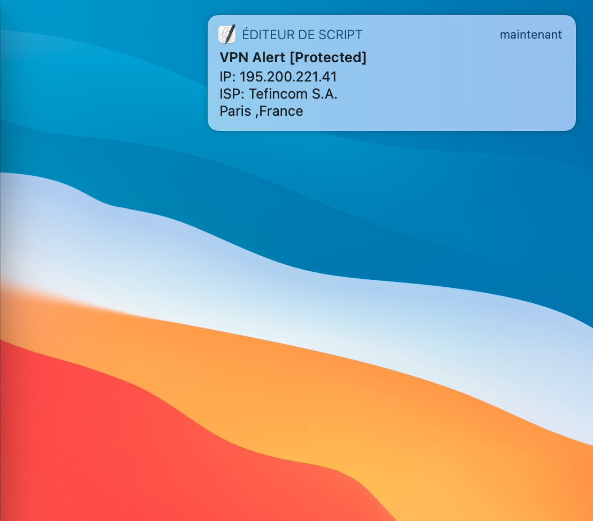

# nordvpn_connection_status

## Author 
Abdelilah, Heddar github -> ClouDevops101
<a href="https://cloudevops.io"></a>
<a href="https://cloudevops.io"></a><a href="https://dc.cloudevops.io"></a><a href="http://bit.ly/GitHubAH"></a><a href="https://www.linkedin.com/in/kaaw/"></a><a href="https://www.paypal.com/paypalme/HAAW"></a>

## Credits :
Many thanks to @Dreyer https://gist.github.com/Dreyer/
161b920f0d8300ed3bc750ae2f80c339
 where you can find the script in it's shell version with curl

<p align="center">
  
</p>

## Descption :
 This script written in  check if you are realy connected to nordvpn, very handy if you are connected over a router and you do not have the application standard notification

## How it works :
 it will keep tracking the status and hold the state then notify only when status change.


## Reports:

Already tested this second new url URL2='https://api.nordvpn.com/vpn/check/full'
 I see that the result is less accurante than the ajax one
 #### ajax version : 
 ```JSON
 {"coordinates":{"latitude":48.8607,"longitude":2.3281},"ip":"195.200.221.41","isp":"Tefincom S.A.","host":{"ip_address":"195.200.221.41"},"status":true,"country":"France","region":"Paris","city":"Paris","location":"France, Paris, Paris","area_code":"75001","country_code":"FR"}
 ```
 #### api version  : 
  ```JSON
  {"ip":"195.200.221.41","isp":"Unknown","status":"Protected","country":"Germany","code":"DE"}
  ```

  ###### for awesome badges 
  https://github.com/alexandresanlim/Badges4-README.md-Profile/blob/master/README.md